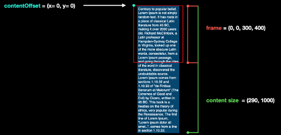
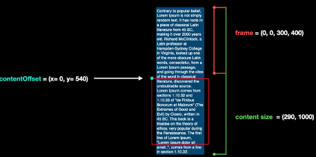

# UIScrollView

##### Наследуется от: **UIView**
##### Родительский для: **UITextView, UICollectionView, UITableView**
Главная задача, которая стоит перед UIScrollView это расположить контент который не умещается в границах экрана. Расположенный внутри UIScrollView контент обрезается по границе фрейма, но тем ни менее есть возможность прокрутить контент внутри UIScrollView. Когда мы начинаем прокручивать, UIScrollView меняет contentOffset.
Пример работы UIScrollView: 




После прокрутки:





- **contentSize** 
Свойство которое указывает на размер контента который находится внутри UIScrollView
- **contentOffset**
Свойство которое указывает на позицию во время прокрутки контента. 
- **isPagingEnable**
Свойство для режима постраничной прокрутки
- **isDragging**, **isTracking**
Свойство которое указывает на состояние UIScrollView
- **zoomScale**, **maximumZoomScale**, **minimumZoomScale**
Свойства необходимые для масштабирования контента
* * *

## UIScrollViewDelegate

### Scrolling
Методы делегата UIScrollView. Они помогают отслеживать что происходит с UIScrollView, как она реагирует на взаимодействие.
- **scrollViewDidScroll**: 
Вызывается, когда прокручивается контент, вызывается не только при пользовательском прокручивании, но и программном.
- **scrollViewShouldScrollToTop**:
Спрашивает делегат о том, должен ли скролл прокручиваться то верхней части. 
- **scrollViewDidScrollToTop**:
Вызывается, когда контент был прокручен до верхней границы. 
- **scrollViewWillBeginDecelerating**:
Вызывается, когда скролл начинает замедлять движение прокрутки. 
- **scrollViewDidEndDecelerating**:
Вызывается, когда закончено замедление движения прокрутки. 
- **scrollViewDidEndScrollingAnimation**:
Вызывается, когда заканчивается анимация прокрутки. 

### Dragging
Методы, которые вызываются только в ответ на пользовательское взаимодействие:
- **scrollViewWillBeginDragging**:
Вызывается тогда, когда пользователь двигает пальцем по контенту. 
- **scrollViewWillEndDragging:withVelocity: targetContentOffset:**
Вызывается, когда пользователь прокрутил контент и отпустил палец. Аргументы метода говорят о скорости прокрутки, и точка, в которой будет завершена анимация. 
- **scrollViewDidEndDragging:willDecelerate:**
Вызыватся когда пользователь закончил прокрутку. 

### Zooming
- **viewForZoomingInScrollView**: 
Возвращает UIView которую будут масштабирать UIScrollView 
- **scrollViewWillBeginZooming:withView:** 
Вызывается, когда пользователь началь масштабировать контент.
- **scrollViewDidEndZooming:withView:atState:**
Вызывается, когда пользователь закончил масштабировать контент.
- **scrollViewDidZoom:**
Вызывается на протяжении всего того времени пока пользователь двигает пальцами. 

Что бы заработало масштабирование, необходимо соблюдать три правила:

1.   Установить **minimumZoomScale** (от 0 до 1, по умолчанию 1)
2.   Установить **maximumZoomScale** (по умолчанию 1, может быть 3.   Определить метод делегата **viewForZoomingInScrollView**:


* * *

## Working with UIScrollView

1. Создаем UIScrollView
Как и любой другой UIView, перетащите объект в сториборде, или создайте програмно alloc/initWithFrame: 
Или выберите UIView в сториборд и выберите "Embed In -> Scroll View" в меню редактора.


2. Добавляем контент используя addSubview:
```objc
UIImage *image = [UIImage imageNamed:@"bigimage.jpg"];
UIImageView *iv = [[UIImageView alloc] initWithImage: image];
[scrollView addSubview: iv];
```
Все добавленные таким способом дочерние элементы будут находится в позиции (0,0)

3. Не забудьте указать contentSize
Распространенная ошибка заключается в том, чтобы сделать вышеупомянутые 3 строки кода (или встроить в Xcode) и забыть про:
`scrollView.contentSize = imageView.bounds.size`

* * *

## Scrolling programmatically
```objc
- (void)scrollRectToVisible:(CGRect)rect animated:(BOOL)animated;
```
Прокручивает содержимое к указанной области. 

Альтернативный вариант: 
```objc
- (void)setContentOffset:(CGPoint)contentOffset animated:(BOOL)animated;
```
Здесь необходимо указать точку, к которой необходимо сделать отступ для UIScrollView

* * *

