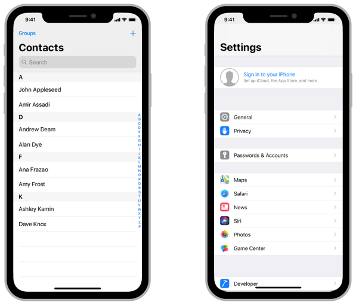
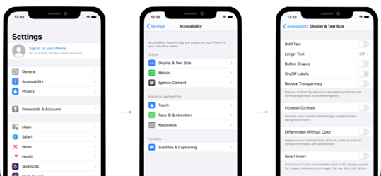
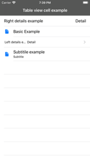

UITableView

# UITableView
UITableView - один из самых распространенных компонентов в iOS разработке, используется практически во всех проектах. Table view представляет собой набор ячеек и способен скролится. 





Table view styles


Существует два стиля отображения: 
- **Plain**
Ячейки могут идти единым списком, так и быть разделенными на некоторые секции. Для каждой секции можно добавить header и footer. Header может отображатся перед первым элементом. Если мы добавляем header, то при скролинге он всегда крепится к верху, пока секция, к которой принадлежит header не закончится. 
- **Grouped**
Ячейки всегда разделены на группы, к которым предшествует header и footer. При данном стиле таблица всегда содержит хотя бы одну группу, и каждая группа содержит как минимум одну ячейку. В этом стиле header всегда скролится вместе с контентом, в отличии от plain стиля. 


## Table view navigation
Таблицы обычно используются в приложениях, в которых данные имеют иерархическую структуру, в таком случае приложение часто использует UITableView в связке с UINavigationController. В таком случае мы получаем простую навигацию между разными уровнями иерархии. Такой подход можно наблюдать в нативном приложении Settings. 




UITableViewCell
Как было сказанно ранее, данные в таблице размещены в ячейках, ячейки в таблице относятся к классу UITableViewCell. Стандартные конфигурации ячеек отображают простую комбинацию текста и изображений, но вы можете наследоваться от класса UITableViewCell для определения уникального внешнего вида и поведения. 

Table view cells styles





UIKit предоставляет четыре стандартных стиля для ячеек: Basic (Default), Subtitle, Right Detail, Left Detail.
- Basic (Default)
Опциональное изображение в левой части ячейки, за которым следует текст, выровненный по левому краю. 
Используйте константу UITableViewCellStyleDefault, чтобы установить этот стиль.
- Subtitle
Опциональное изображение в левой части ячейки. Справа от изображения выровненный по левому краю две строки текста (заголовок и подзаголовок)
Используйте константу UITableViewCellStyleSubtitle, чтобы установить этот стиль.
- Right Detail
Выровненный по левому краю заголовок с выровненными по правому краю подзаголовком на той же строке.
Используйте константу UITableViewCellStyleValue1, чтобы установить этот стиль.
- Left Detail
Выровненный по правому краю заголовок, за которым следуют выровненные по левому краю подзаголовком на той же строке.
Используйте константу UITableViewCellStyleValue2, чтобы установить этот стиль.

* * *

## Adding a Table View
**Step 1:**
Добавить свойство UITableView в нашем контроллере: 

```objc
@interface ViewController : UIViewController
@property (nonatomic, strong) UITableView *tableView;
@end
```

**Step 2:**
Инициализируем UITableView. 

```objc
- (void)viewDidLoad {    
    [super viewDidLoad];
    // ...
    // Создаем объект
    self.tableView = [[UITableView alloc] init];
    // Регистрируем ячейку
    [self.tableView registerClass:UITableViewCell.class forCellReuseIdentifier:@"CellId"]; 
    // Дбавляем tableView как subview
    [self.view addSubview:self.tableView];
    // add constraints if needed
}
```

**Step 3:**
Для того чтобы Table View отобразил какие-то данные, их необходимо предоставить через DataSource объект. Этот объект должен поддерживать протокол UITableViewDataSource. Он не только предоставляет данные для отображения, но и управляет моделью данных когда они добавляются/ удаляются / меняют порядок. 

```objc
@interface ViewController : UIViewController <UITableViewDataSource, UITableViewDelegate>
@property (nonatomic, strong) UITableView *tableView;
@end
```
В нашем примере роль DataSource выполняет контроллере, но в этом качестве может выступать любой объект. 
Также для настройки внешнего вида, отслеживания поведения и событий в TableView, необходимо назначить делегата, который поддерживает протокол UITableViewDelegate. В нашем случае это также будет контроллер и реализовать обязательные методы делегатов:
```objc
- (NSInteger)tableView:(UITableView *)tableView numberOfRowsInSection:(NSInteger)section {
    return 10.0;
}
- (UITableViewCell *)tableView:(UITableView *)tableView
         cellForRowAtIndexPath:(NSIndexPath *)indexPath {
    UITableViewCell *cell = [tableView dequeueReusableCellWithIdentifier:@"CellId" forIndexPath:indexPath];
    cell.textLabel.text = [NSString stringWithFormat:@"%lu", indexPath.row];
    return cell; 
}
```
**Step 4:**
Указываем что текущий контроллер (или любой другой объект) реализуют проток делегата и DataSource.
```objc
- (void)viewDidLoad {
    // ...
    self.tableView.dataSource = self;
    self.tableView.delegate = self;
}
```


## UITableViewController vs UITableView
Для таблицы можно использовать UITableViewController. Его приемущество в том, что он уже реализует нужные протоколы, уже назначал делегата и DataSource. Однако как правило UITableViewController может содержать только UITableView, и вы не можете более гибко настраивать свой интерфейс. In addition implements the following behaviors:

- It automatically loads the table view archived in a storyboard or nib file. Access the table view using the tableView property.
- It implements the viewWillAppear: method and automatically reloads the data for its table view on first appearance. It clears its selection (with or without animation, depending on the request) every time the table view is displayed; you can disable this behavior by changing the value in the clearsSelectionOnViewWillAppear property.
- It implements the viewDidAppear: method and automatically flashes the table view's scroll indicators when it first appears.
- It implements the setEditing:animated: method and automatically toggles the edit mode of the table when the user taps an Edit|Done button in the navigation bar.
- It automatically resizes its table view to accommodate the appearance or disappearance of the onscreen keyboard.


* * *
## UITableViewDelegate
Вот некоторые вещи, которые делает делегат UITableView:
-	Кастомизация отображения
-	Управление режимом выбора
-	Изменение header & footer
-	Настройка, включение\отключение режима редактирования 
-	и т.п.

#### Display customizations
Table View может иметь разную высоту для каждой ячейки, в зависимости от того какую высоту вы укажите.

```objc
- (CGFloat)tableView:(UITableView *)tableView
    heightForRowAtIndexPath:(NSIndexPath *)indexPath;
```
Метод возвращает высоту для конкретной ячейки. 
Либо, UITableView умеет автоматически рассчитывать высоту, базируясь на контенте этих ячеек. В этом случае в этих методах необходимо вернуть константу UITableViewAutomaticDimension. Для корректной работы нужно привязать контент к границам ячейки используя autolayout. 

```objc
- (CGFloat)tableView:(UITableView *)tableView
    estimatedHeightForRowAtIndexPath:(NSIndexPath *)indexPath;
```
Метод возвращает дефолтную высоту для ячейки при автоматическом расчете высоты. Этот метод нужен для оптимизации, рассчитывать высоту автоматически довольно затратная операция. 
#### Selections managing
UITableView может уведомлять делегата о том что пользователь собирается или выбрал какую то ячейку. Это хорошее место для конфигурации нового контроллера. 
```objc
- (NSIndexPath *)tableView:(UITableView *)tableView
    willSelectRowAtIndexPath:(NSIndexPath *)indexPath;
- (void)tableView:(UITableView *)tableView
    didSelectRowAtIndexPath:(NSIndexPath *)indexPath;
```
#### Modifying Header and Footer
Для использования кастомного представления используются следующие методы: 
```objc
- (UIView *)tableView:(UITableView *)tableView
    viewForHeaderInSection:(NSInteger)section;
- (UIView *)tableView:(UITableView *)tableView
    viewForFooterInSection:(NSInteger)section;
```
#### Editing Table View Rows
Вы можете включать режим редактирования для UITableView, для того чтобы добавить \ удалить \ переместить ячейки. Для того что бы сделать этот режим доступным - необходимо реализовать следующие методы, в котором необходимо вернуть YES: 
```objc
- (BOOL)tableView:(UITableView *)tableView
    canEditRowAtIndexPath:(NSIndexPath *)indexPath;
Для определения стиля редактирования необходимо релизовать следующий метод:
- (UITableViewCellEditingStyle)tableView:(UITableView *)tableView
           editingStyleForRowAtIndexPath:(NSIndexPath *)indexPath;
```

Так же есть возможность определить конфигурацию по свайпу ячейки влево или вправо: 
```objc
- (UISwipeActionsConfiguration *)tableView:(UITableView *)tableView
    leadingSwipeActionsConfigurationForRowAtIndexPath:(NSIndexPath *)indexPath;
- (UISwipeActionsConfiguration *)tableView:(UITableView *)tableView
    trailingSwipeActionsConfigurationForRowAtIndexPath:(NSIndexPath *)indexPath;
```

### UITableView updating API

```objc
- (void)reloadData;
- (void)reloadSections:(NSIndexSet *)sections withRowAnimation:(UITableViewRowAnimation)animation;
- (void)reloadRowsAtIndexPaths:(NSArray<NSIndexPath *> *)indexPaths withRowAnimation:(UITableViewRowAnimation)animation
```

Методы, которые позволяют вставить, удалить, перезагрузить и переместить секцию таблицы. 
```objc
- (void)insertSections:(NSIndexSet *)sections
      withRowAnimation:(UITableViewRowAnimation)animation;
- (void)deleteSections:(NSIndexSet *)sections
      withRowAnimation:(UITableViewRowAnimation)animation;
- (void)reloadSections:(NSIndexSet *)sections
      withRowAnimation:(UITableViewRowAnimation)animation;
- (void)moveSection:(NSInteger)section
          toSection:(NSInteger)newSection;
```

Такие же методы для ячеек:
```objc
- (void)insertRowsAtIndexPaths:(NSArray<NSIndexPath *> *)indexPaths
              withRowAnimation:(UITableViewRowAnimation)animation;
- (void)deleteRowsAtIndexPaths:(NSArray<NSIndexPath *> *)indexPaths
              withRowAnimation:(UITableViewRowAnimation)animation;
- (void)reloadRowsAtIndexPaths:(NSArray<NSIndexPath *> *)indexPaths
              withRowAnimation:(UITableViewRowAnimation)animation;
- (void)moveRowAtIndexPath:(NSIndexPath *)indexPath
               toIndexPath:(NSIndexPath *)newIndexPath;
```

Метод, который используется чтобы объеденить действия вставки \ удаления\ перезагрузки\ перемещения ячеек и секций в одну транзакцию. 
```objc
- (void)performBatchUpdates:(void (^)(void))updates
                 completion:(void (^)(BOOL finished))completion;
```

* * *

## Useful materials 🤓
[Apple UITableView](https://developer.apple.com/documentation/uikit/views_and_controls/table_views?language=objc)

[Apple UITableViewController](https://developer.apple.com/documentation/uikit/uitableviewcontroller?language=objc)


